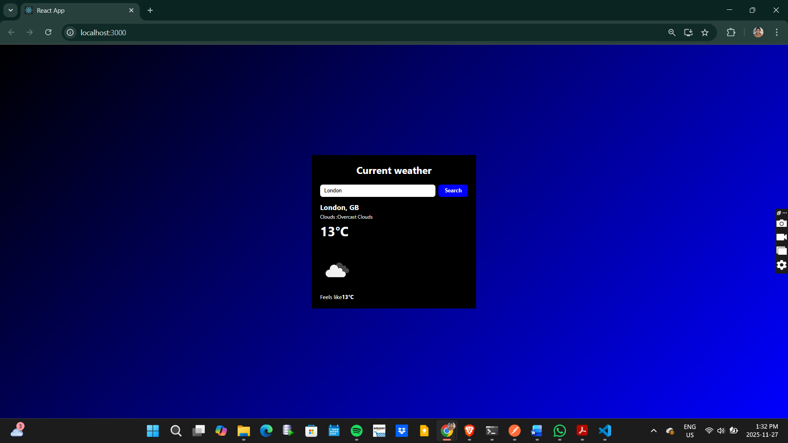
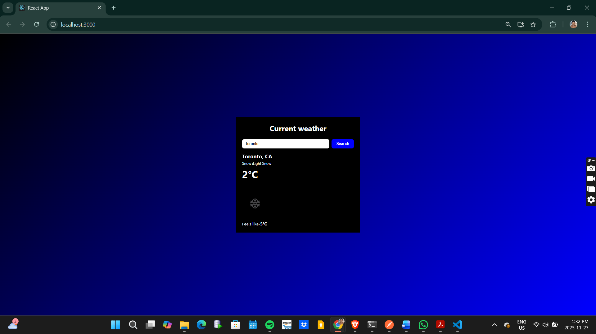

#  101499955_comp3123_labtest2 – Weather App

Project Decription: This is a React weather application built for COMP3123 Lab Test 2.  

It uses the **OpenWeatherMap Current Weather Data API** to display the current weather for a city entered by the user.

## Features include
- Search for a city and get current weather information
- Displays:
  - City and country
  - Weather condition and description
  - Temperature in °C (converted from Kelvin)
  - Feels like
  - Weather icon from OpenWeatherMap
- Built with function components, React Hooks (`useState`, `useEffect`)

# API Used:
The app uses the **OpenWeatherMap** Current Weather API:
- Base URL: `https://api.openweathermap.org/data/2.5/weather`
- Example request:  
  `https://api.openweathermap.org/data/2.5/weather?q=Toronto&appid=YOUR_API_KEY`

You need to create your own API key from `https://openweathermap.org/` (https://openweathermap.org/)

# Setup Steps:
1. Clone the repository:
   git clone https://github.com/<your-username>/101499955_comp3123_labtest2.git
   cd 101499955_comp3123_labtest2

2. Install dependencies:
    npm install

3. Replace the line in the .env file in the project root:
    FROM: REACT_APP_OPENWEATHER_API_KEY=647bed9aab89c0dd89b872114f3f10f1

    TO: REACT_APP_OPENWEATHER_API_KEY=Your_own_api_key

4. Run the app with: 
    npm start

5. Open your browser and test with the url: 
    http://localhost:3000

Screenshots of app:

